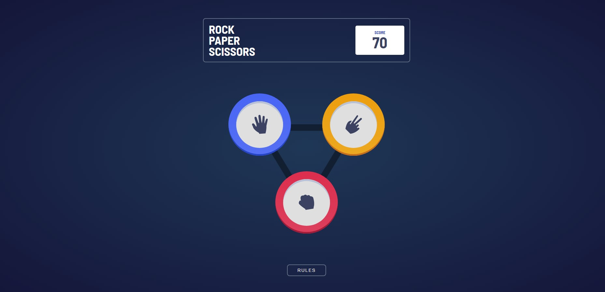
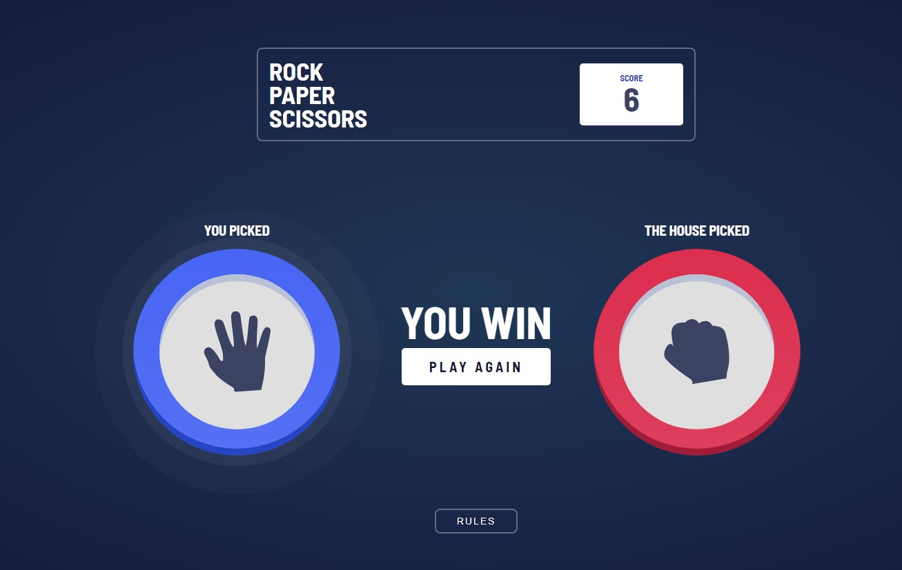
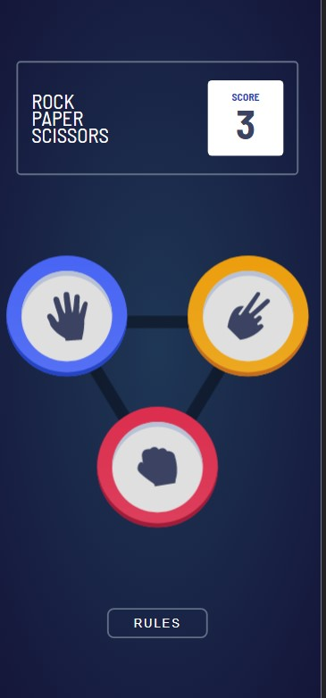
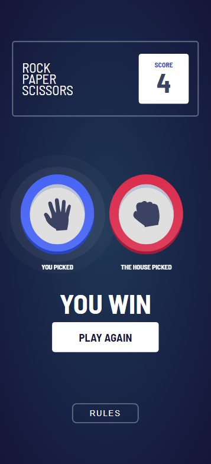

# Frontend Mentor - Rock, Paper, Scissors solution

This is a solution to the [Rock, Paper, Scissors challenge on Frontend Mentor](https://www.frontendmentor.io/challenges/rock-paper-scissors-game-pTgwgvgH). Frontend Mentor challenges help you improve your coding skills by building realistic projects. 

## Overview
### Links

- [Solution URL](https://www.frontendmentor.io/challenges/rock-paper-scissors-game-pTgwgvgH/hub/rock-paper-scissors-with-html-css-and-js-5DPT-9VRYT)
- [Live Site URL](https://codymang.github.io/rock-paper-scissors-js/)
### The challenge

Users should be able to:

- View the optimal layout for the game depending on their device's screen size
- Play Rock, Paper, Scissors against the computer
- Maintain the state of the score after refreshing the browser _(optional)_
- Reset Score by right clicking on the score box

### Screenshot






### Built with

- CSS custom properties
- Flexbox
- CSS Grid
- CSS animation
- Mobile-first workflow
- Event Listeners

### What I learned

This took me longer than I like to admit and now know there is a better way. I did the math so it would by perfect for its container.
```html
 <svg ... width="360" height=360 xmlns="http://www.w3.org/2000/svg">
      <polygon ... points="72,97 288,97 180,276"... />
 </svg>
```

### Useful resources

- [Firseship](https://youtu.be/Qhaz36TZG5Y?t=422) - This channel is one of my favorites for dipping my toes into new technologies.It's very straight foward and I always learn something new. This particular video hada neat CSS trick that I ended up using.

- [MDN Web Docs](https://developer.mozilla.org/en-US/) - While I could list out every article that I used from MDN, I would rather keep this concise. This is definitely my favorite resource to learn about everything HTML, CSS, and JS.

- [W3 Schools](https://www.w3schools.com/w3css/defaulT.asp) - This resource is great if I want to quickly learn what a keyword does. It is much simpler and is my prefered website when quickly looking something up.


## Author

- Frontend Mentor - [@CodyMang](https://www.frontendmentor.io/profile/CodyMang)

